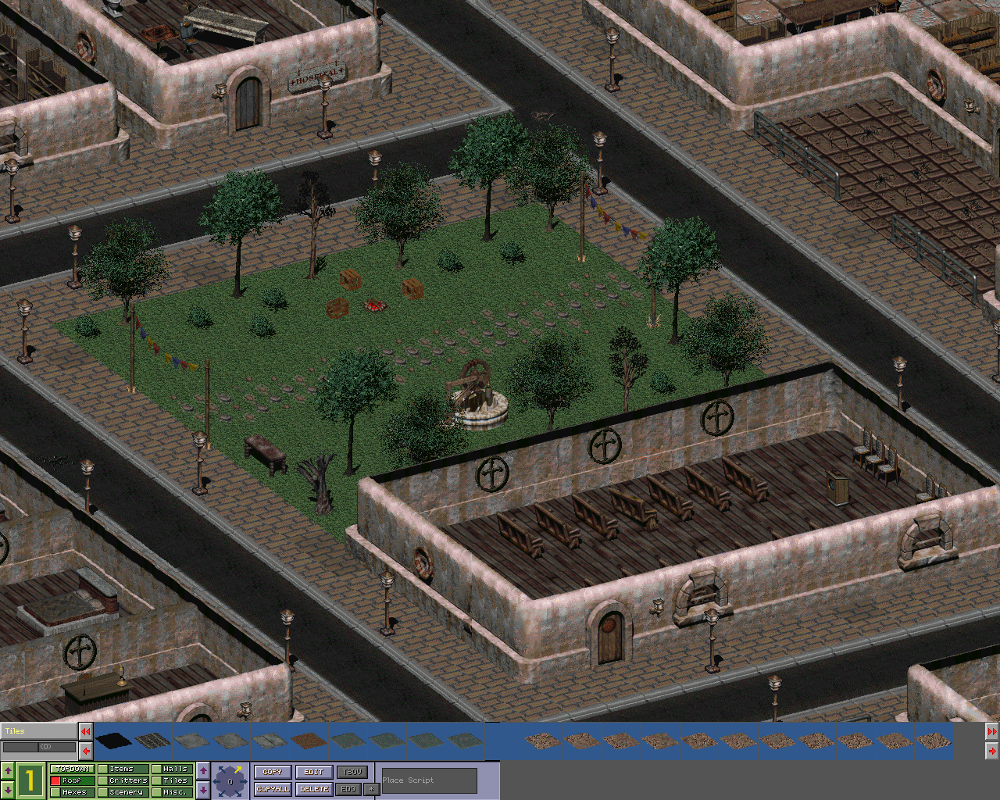
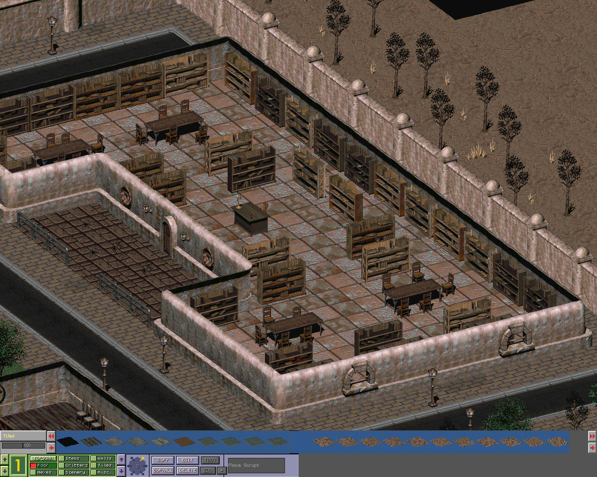
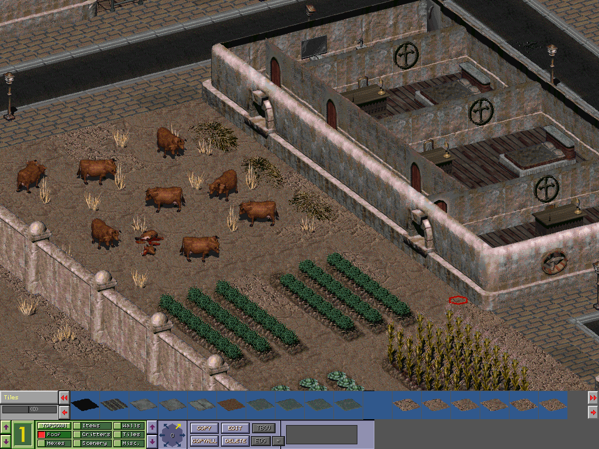
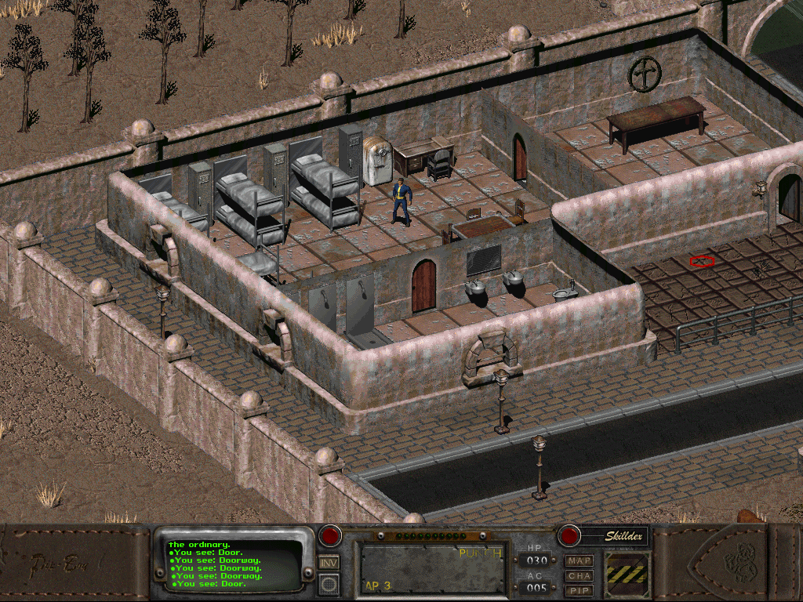
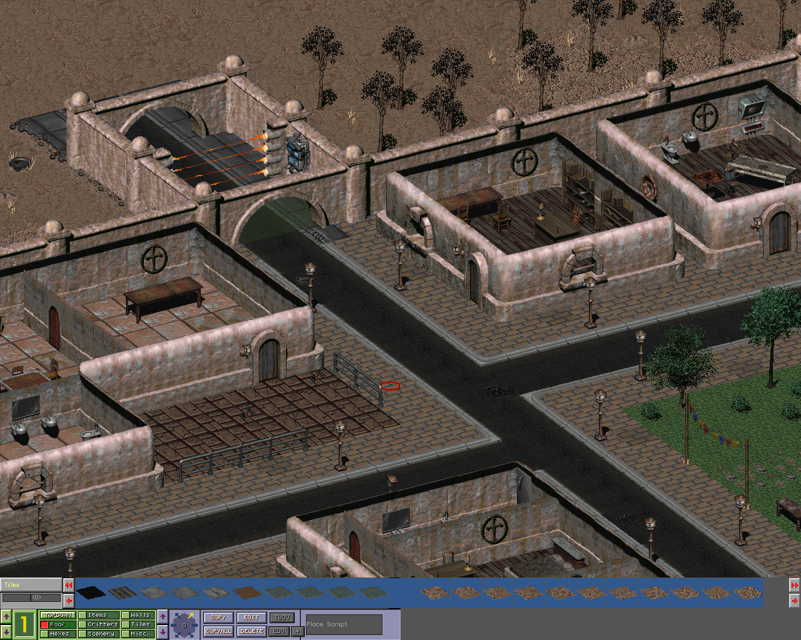
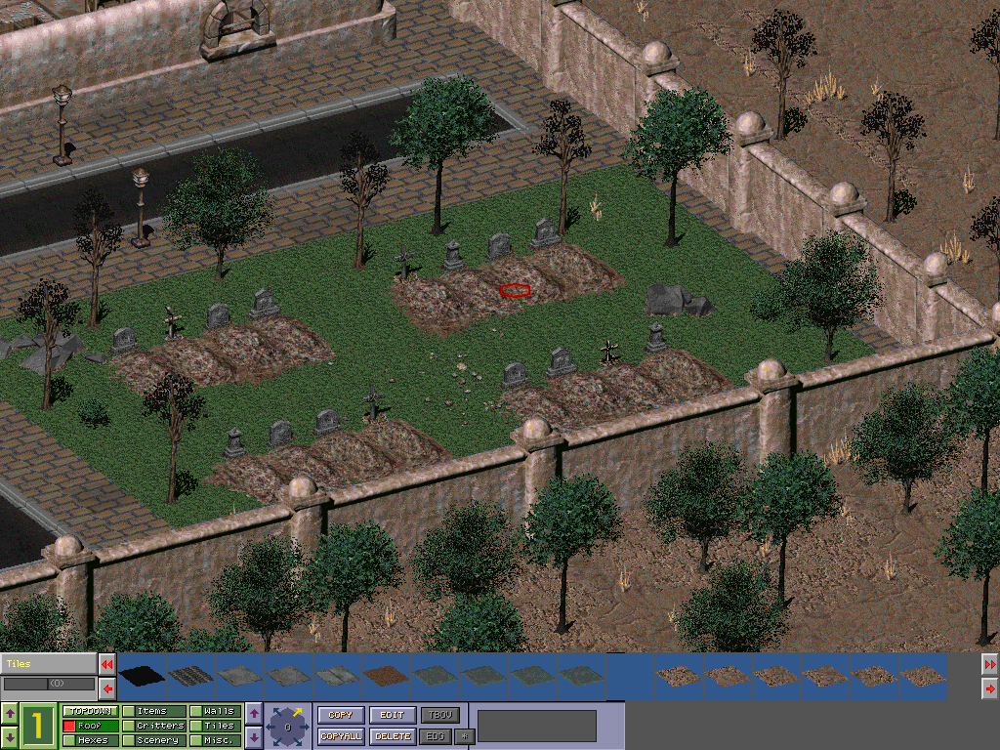

 

Abbey is a partially complete mod for *Fallout 2* (1998) that I made right before the start of my freshman year of college. The map itself is complete and likely playable, but it's missing NPCs, quests, and associated scripting and dialogue. Much of the story, quests, and characters exist and are in notebooks of mine, but the main reason it never got finished is that I just ran out of time when school started. I don't know if I will finish the mod but I may try to if I can get around to it.
 
## Background
 
I was looking for a game modding project I could do in the weeks leading up to the start of classes, and being a Fallout fan with plenty of ideas for the series I naturally started eyeing some of the games. I'd recently been watching hours on top of hours of playthroughs of Fallout 1 and 2, and figured that they would be easy games to mod relative to their younger 3D siblings (this turned out to be both true and very false). I wasn't sure if I wanted to make something fully from scratch, so I browsed around on the Fallout wiki for things I could mod when eventually I stumbled upon [Abbey](https://fallout.fandom.com/wiki/Abbey). I felt like this would be a really good place to mod in, as it has some basic lore already made but still has a ton of room for expansion. It also is technically cut content, so there are some remaining references in the base game that will make it easy to link the mod with the game later. It also has defined media as an inspiration, most notably the 1959 book [A Canticle for Leibowitz](https://en.wikipedia.org/wiki/A_Canticle_for_Leibowitz).
 
## Challenges & Modding tools
 
Modding Fallout 2, when you break it down, is actually super simple. The main problems are that it's an old game and that the modding community around it is relatively small. As such, most of the tools I used are very old and there is little to no documentation. Almost all existing info and resources are concentrated on the No Mutants Allowed forum and in posts that are sometimes older than me. This posed two problems, a tech problem and a resources problem.
 
### Tech problems
 
There are several community made tools that I used to make this mod possible, but there are likely more I don't remember. The biggest ones are [BIS Mapper](https://www.nma-fallout.com/resources/bis-mapper.55/) (the mapping tool) [Fallout Dialogue Converter](https://www.nma-fallout.com/threads/fallout-dialogue-creator-0-28-released-formerly-fmf-dialogue-tool.215927/) (a dialogue tree creation tool), and [sfall](https://sourceforge.net/projects/sfall/) (a scripting tool). There's also several smaller pieces of software I used, such as [high resolution patchers](https://www.nma-fallout.com/threads/hi-res-patches-for-fallout1-2-the-bis-mapper.181743/) to allow the mapper to run at resolutions above 480p, and a [.dat file explorer](http://www.nma-fallout.com/resources/dat-explorer-by-dims.56/) to unpack assets and libraries from the base game. Most of these will not run properly without a compatibility layer, as almost none will run natively on Windows 10. I found that Windows XP/Windows 95 mode seemed to work best for most of these.
 
As you may be able to guess, these tools were janky and finicky at best and straight up didn't work at worst. The mapper itself was a landmine to use; if you didn't open it properly or if you pressed the wrong button, the program would crash or stop working. There's also none of the creature comforts of modern engines and modding tools. You have to manually scroll through assets, there's no easy undo or copy features, and many unknown or broken features.
 
### Resource problems
 
As I've talked about before, there is very little information that exists about modding early Fallout games. I have so much appreciation for the NMA forum for keeping all of these old posts and harboring a community for Fallout modders and resources. In absence of real documentation, most of my references were to forum posts which themselves lacked a lot of info (some of the entries on a post about BIS Mapper keymaps just said “crashes”). I’ll share some of those resources below:

* [The guide I used to get started](https://www.nma-fallout.com/threads/how-to-journal-creation-of-the-mod-innocence-lost.213406/)
* [Mapper Keys](https://www.nma-fallout.com/threads/mapper-keys-1-6.156587/)
* [Wiki tutorials](https://falloutmods.fandom.com/wiki/Fallout_2_editor_introduction)
* [Fallout 2 Modding Wiki](https://falloutmods.fandom.com/wiki/Category:Fallout_2)
* [Another modding tutorial link](http://archive.nma-fallout.com/content.php?page=fo-modding)
* [Additional tools/critter editors](https://www.nma-fallout.com/threads/new-tools-for-fallout-1-2.196393/#post3871106)
 
As a sort of aside, this was also the first time I've worked on an isometric game ([although it's technically cavalier oblique](https://youtu.be/T2OxO-4YLRk?t=1356)). It also uses a hexagonal tilesystem which Tim Cain gives good reasons for in the clip I just linked, but it can be sort of hard to wrap your head around while mapping.
 
## Lore & Design
 
I've written a lot of lore for this map but since none of it has been implemented yet I'll keep this to a brief overview. The general idea was that the Brotherhood of Steel was eyeing the monastery for its repository of open information, and was intending to slowly take it over through a series of false diplomatic moves and covert operations such as poisonings. Within the monastery there is division on how to handle the situation; some members have a hunch that the Brotherhood are the ones behind it and want the monastery to take action, but current monastery leaders either don't believe that the Brotherhood is behind it or would rather defend the monestary's principles of freedom of information.
 
I wanted to capture the classic Fallout system of choice freedom and consequences, so here are a few possible endings to the questline:
- The player can side with the Brotherhood, essentially helping them seize Abbey by force
- The player can side with the faction of monks who are concerned about the Brotherhood
- The player can side with the current monk leadership
- Wildcard: The player can solve the quest several more ways than is listed possible here, so I can't include them all. Some options are destroying the libraries yourself, killing Brotherhood spies, and playing double-agent, among others.
 
Each of these options has smaller quests, objectives, and plot points associated with them to allow players to learn more about the world and characters within it. Each choice has implications and consequences, both real and moral, which is what makes them so compelling. Most importantly, the consequences would be communicated to the player as they decide (for example, it's hinted that the Brotherhood will be able to take over the monastery if they player goes with the second option, or that the monks intend to use violence against their own if they go with the third). The player would have the ability to handle each of these options in ways they'd like, by stealth, speech, violence, etc within the bounds of Fallout's acceptable character ranges.
 
That’s just the main questline, there’s also a few smaller quests to familiarize the player with various characters and lore to better inform their understanding of the choices in the main quest.
 
This map was made off an existing map in the game, the [NCR Downtown](https://fallout.fandom.com/wiki/NCR_Downtown) mainly because starting fully from scratch would take both time and skill I did not have. From there I basically tore the map apart and rebuilt it based on my drawings. Trying to create and import my own sprites would also be a nightmare, so I resorted to just using existing tiles and sprites. I tried to make sure my map followed a semblance of the lore and could also fit the idea of a monastery based on [reference images and information](https://en.wikipedia.org/wiki/Monastery). All in all I think it looks alright; I'm by no means a level designer and designing multilevel structures in the mapping tool is another level of difficulty.
 
## Reflections
 
Even though this was not the easiest project ever, I’m still glad I did it and I hope to finish it one day. I think jumping in the deep end by using an old game without much info was a great learning experience and is a good practice in troubleshooting and experimentation. I’m also not a great level designer, so this was fun practice and in all honesty while the tools can be frustrating at times it’s still fun to do (and much easier than making maps in 3D). Fallout is a series I've loved for a long time and I especially enjoy the writing and design style of many of Interplay's greats, like Tim Cain, Leonard Boyarsky, and Chris Avellone.
 
## Gallery & Downloads
 
Here’s a gallery of images for the map and a video demo. There’s also downloads of the map available below; I don’t actually know if I included the right things or how to bundle it with the main game. I know there’s a tool to generate an installer but sadly I don’t have time to set that up now.

[Download Abbey's map files here](https://github.com/jackburkhardt/abbey)
 
  
  

