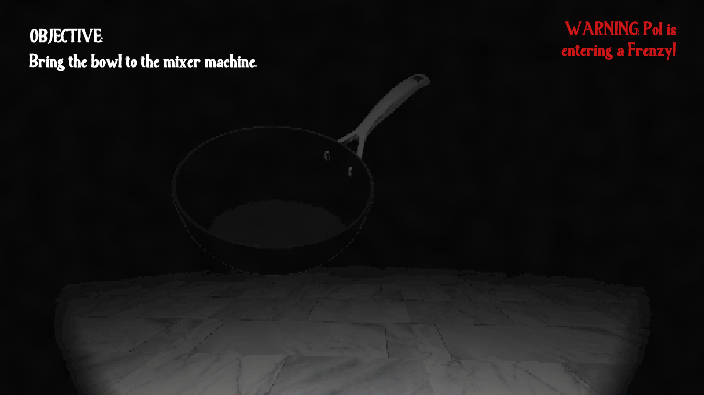

**Project Start Date:** November 12th, 2021 | **Project Finish Date:** November 15th, 2021

This game was a homework assignment for Northwestern CS 376, made in roughly 3-4 days. You'll learn more background about the game itself once you start playing, but it's essentially a "horror" "baking" "simulator" where you must collect ingredients and bake a cake before you get caught by French-Canadian chef Pol Martin (he's...[a character](https://twitter.com/oakeymations/status/1319129464438140928)). Also, it's completely dark and you only have a flashlight.

The assignment requirements were just to make a simple game while implementing certain requirements for physics and object behaviors. I chose to implement my game in 3D instead of 2D, and while it was not mentioned or required by the assignment I figured it would be good practice with Unity3D. I used this game as a way to experiment more with lighting, materials, models, animation rigging, and systems for managing game functions (such as a game state system or a beefed up version of the audio handler from the last assignment I did).

## Download and source code

You can find the source code on the [GitHub repository](https://github.com/jackburkhardt/chefhunt) and builds of the game for Windows, macOS, and Linux under the [Releases](https://github.com/jackburkhardt/chefhunt/releases) page.

## Gallery

<video width="100%" height="auto" controls loop autoplay> <source src="./gameplay.webm" type="video/webm"></video> 

<video width="100%" height="auto" controls loop autoplay> <source src="./frenzy.webm" type="video/webm"></video>