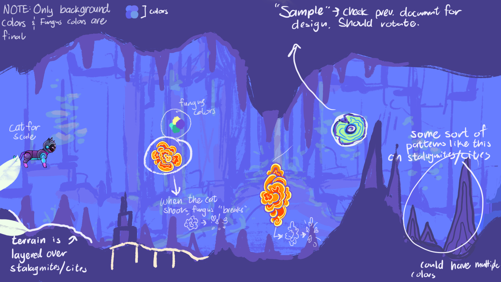

*Note: Due to IP and non-disclosure agreements, the detail to which I can describe some of my work here is limited.*
  
I was a founding member and lead software engineer for [Overture Games](https://www.overture.games/) where I helped develop our first release title, *Intervallic*. It aims to make instrument practice for students by fun through audio-responsive gameplay, feedback about how you're playing, and encouraging constant practice. The game supports audio input through MIDI and microphone, and will work with many instruments and vocals. Players must play the correct notes to advance through levels and can play certain intervals to activate special abilities or mechanics.

I've gotten to build a lot of really cool tech for this game. I've created a level editor that allows users to provide their own music and design levels around their skills. On the systems side I made many internal tools and did a lot of work with platform integration and player metrics collection. But my work can also be seen on more user-facing features including gameplay and audio/pitch detection.  Outside of just technology, I've learned a lot about how the startup fundraising process works and how to work through difficult times as a team.

Overture is still a quite small team so I often get to wear a lot of hats. Depending on the day I might act as a writer, producer, business analyst, technical designer, QA tester, or many other critical roles in game and software development. It's been a really awesome way to explore all of the different sides of the industry and has helped me become a more well-rounded developer.

Once we got funding from the [Techstars accelerator](https://www.techstars.com/newsroom/announcing-the-techstars-chicago-fall-2023-class) and released Intervallic, I realized that we needed to really get our act together to work with external stakeholders. My last few months with the studio have been focused on smoothing development operations, heavy documentation, and addressing post-release user feedback.

Here's some early concept art:
 

## Lessons

I left Overture in the fall of 2023 due to disagreements about company direction. I remain a shareholder in the company. Here are some of my biggest takeaways from my time at Overture:

- If you're going to write "throwaway" code, make sure you can actually throw it away
- Larger projects *need* a plan of action and plan of validation, otherwise they can quickly grow out of control
- Not speaking up is not only a disservice to you but also a disservice to the rest of your team
- Communication between business and product teams is crucial to understanding user needs AND development constraints
- Know when to say no! We couldn't do everything we wanted, so better to focus on doing a few things very well
- Don't take for granted the people who volunteer their time to support your mission
   

## Release information

Intervallic launched in Early Access in October 2023 on [Steam](https://store.steampowered.com/app/2270460). Free demos of the game are available on Steam and [itch](https://overturegames.itch.io/intervallic)!

## Media featuring Intervallic

08/15/2022  | [Overture Games Team Spotlight](https://thegarage.northwestern.edu/news/overture-games-team-spotlight/)  \
11/21/2022  | [Glimpse under the hood: The Garage’s undergraduate projects](https://dailynorthwestern.com/2022/11/21/photo/captured-glimpse-under-the-hood-the-garages-undergraduate-projects) \
05/05/2023  | [The Next Generation of Game Developers: Talking with Overture Games About Inspiration and Innovation](https://www.sceneandheardnu.com/content/2023/5/5/the-next-generation-of-game-developers-talking-with-overture-games-about-inspiration-and-innovation) \
05/14/2023  | [NU Declassified: Built This – Overture Games aims to turn practice into play](https://dailynorthwestern.com/2023/05/14/audio/nu-declassified-built-this-overture-games-aims-to-turn-practice-into-play/) \
05/23/2023  | [What's cooking in Northwestern's startup hub](https://www.chicagobusiness.com/crains-daily-gist/checking-startup-progress-northwesterns-garage) \
09/11/2023  | [Announcing the Techstars Chicago Fall 2023 Class](https://www.techstars.com/newsroom/announcing-the-techstars-chicago-fall-2023-class)