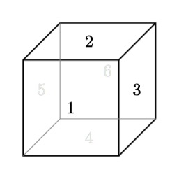
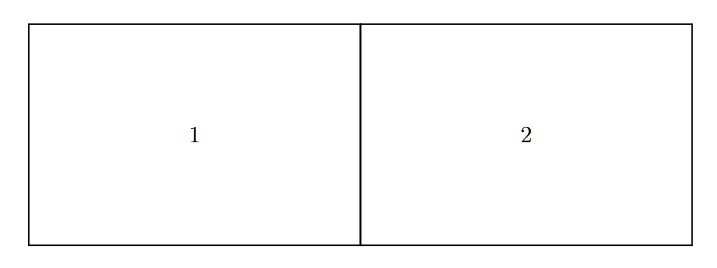

[VastWaste](https://www.ozgesamanci.com/#/vastwaste/) and [Mind the Debris](https://www.ozgesamanci.com/#/mind-the-debris/) are two versions of the same project I worked on as part of a research grant for Summer 2021. I worked under Prof. Ozge Samanci, an artist and instructor at Northwestern University. I did a lot of programming and implementation, including building the projection system, creating visual effects, and other miscellaneous features. This was my first Unity Engine project ever! Once the piece was public I traveled to exhibitions such as ISEA2022 to set up the installation, speak with visitors, and hold talks about VastWaste.

## Premise

Humans once perceived oceans as boundless, and thus impossible to pollute -- until we created the Great Pacific Garbage Patch. The same pattern is now repeating in outer space. VastWaste is a data-driven, projection art installation that illuminates the parallels and interplay between marine pollution and space debris. It can also be experienced in Virtual Reality.

The principal difference between these pieces is that *Mind the Debris* uses a HTC Vive with attached EEG sensors. The sensor data gets sent over to Unity and impacts parts of the installation, including music and collisions. The *VastWaste* version uses other sources of data to handle debris timing and frequency, such as ocean currents and Twitter data.

Details, pictures, and more information about this piece can be found on Ozge Samanci's website (hyperlinked above).

## Development

While VastWaste is primarily intended for VR, we wanted onlookers to be able to share the immersive experience as well. I designed a system that allows the installation to be projected in various orientations onto walls or screens. It uses several virtual cameras, wall-mounted projectors, and a bit of manual tuning to project a stunning space or ocean view on up to 6 surfaces.

The supported layouts for the projection system are highly adjustable, which is important as the wall/screen layouts can differ greatly between venues. Some example layouts we've used this for include "room-scale" or "side-by-side", pictured below:

  

Despite my inexperience with Unity at this point, I did identify some operational inefficiencies in the development process and worked with the rest of the team to find a solution. We switched from zipping and sending the project files to using Git for version control, and I wrote documentation for the venue tech crew so that they are able to set up in our absence.

I also did some visual refinement, including color and lighting adjustments, smoothing out scene transitions, and more to make sure it was in tip-top shape for review.

## Exhibitions

VastWaste has been featured at several international media arts festivals, including but not limited to:

06/13/2022  | [27th International Symposium of Electronic Art](https://isea2022.isea-international.org/event/citm-upc-vastwaste/), Barcelona, ES  \
08/11/2022 	| [SIGGRAPH Art Gallery, Vancouver](https://s2022.siggraph.org/presentation/?id=artg_158&sess=sess227), Canada, BC \
10/17/2022  | [20th Piksel Festival for Electronic Art](https://22.piksel.no/), Bergen, NO \
07/05/2023  | [FILE Festival 2023](https://file.org.br/), São Paulo, BR \
09/19/2023  | [NOVA @ Museum of Tomorrow](https://museudoamanha.org.br/en), Rio de Janeiro, BR 

## Press coverage & publications

06/14/2022  | [Terrassa Digital](https://terrassadigital.cat/veure-la-deixalla-espacial-de-forma-immersiva-des-del-citm/) \
06/25/2022  | [Association for Computing Machinery](https://dl.acm.org/doi/10.1145/3532837.3534952) \
07/01/2023  | [DiVA "Digital, Interactive and Visual Arts" Vol. 54](https://art-science.org/diva/)